# Entity Relationship Diagram

This ERD documents the Assignment 4 SQLite schema implemented in `src/regional_entrepreneurship_intelligence/database/schema.py`.

## Normalization Review

The implemented logical design is normalized to 3NF where practical:

- Reference tables isolate geography, industry, year, and source concepts.
- A dedicated county crosswalk preserves CBSA-county membership at its own grain rather than repeating county fields in `ref_geography`.
- Standardized staging, intermediate, and analytics tables use reference-table foreign keys instead of repeating descriptive geography and industry attributes.
- The canonical analytical table uses the grain `MSA x 2-digit NAICS x year` and does not store global expected entrepreneurship, residual alignment, or final entrepreneurial-gap targets.
- Metadata and quality tables are separated from analytical data so provenance, run state, rejected records, and table metrics do not create repeating groups inside analytical tables.

Documented exception:

- Raw tables are intentionally not forced into strict 3NF. They preserve source-native identifiers and a raw payload for provenance and auditability. This is a deliberate exception because normalizing unknown source-native columns before ingestion would make raw data harder to review and trace.

## High-Level ERD

```mermaid
erDiagram
    REF_GEOGRAPHY ||--o{ STG_BDS : standardizes
    REF_GEOGRAPHY ||--o{ STG_QCEW : standardizes
    REF_GEOGRAPHY ||--o{ STG_CBP : standardizes
    REF_GEOGRAPHY ||--o{ STG_ACS : standardizes
    REF_GEOGRAPHY ||--o{ REF_GEOGRAPHY_COUNTY_CROSSWALK : contains
    REF_GEOGRAPHY ||--o{ INT_ENTREPRENEURSHIP : keys
    REF_GEOGRAPHY ||--o{ INT_INDUSTRY_GROWTH : keys
    REF_GEOGRAPHY ||--o{ INT_REGIONAL_CONTROLS : keys
    REF_GEOGRAPHY ||--o{ INT_BUSINESS_STRUCTURE : keys
    REF_GEOGRAPHY ||--o{ ANALYTICS_MSA_INDUSTRY_YEAR : keys

    REF_INDUSTRY ||--o{ STG_BDS : standardizes
    REF_INDUSTRY ||--o{ STG_QCEW : standardizes
    REF_INDUSTRY ||--o{ STG_CBP : standardizes
    REF_INDUSTRY ||--o{ INT_ENTREPRENEURSHIP : keys
    REF_INDUSTRY ||--o{ INT_INDUSTRY_GROWTH : keys
    REF_INDUSTRY ||--o{ INT_BUSINESS_STRUCTURE : keys
    REF_INDUSTRY ||--o{ ANALYTICS_MSA_INDUSTRY_YEAR : keys

    REF_YEAR ||--o{ STG_BDS : year
    REF_YEAR ||--o{ STG_QCEW : year
    REF_YEAR ||--o{ STG_CBP : year
    REF_YEAR ||--o{ STG_ACS : year
    REF_YEAR ||--o{ INT_ENTREPRENEURSHIP : year
    REF_YEAR ||--o{ INT_INDUSTRY_GROWTH : year
    REF_YEAR ||--o{ INT_REGIONAL_CONTROLS : year
    REF_YEAR ||--o{ INT_BUSINESS_STRUCTURE : year
    REF_YEAR ||--o{ ANALYTICS_MSA_INDUSTRY_YEAR : year

    REF_SOURCE ||--o{ METADATA_SOURCE_MANIFEST : describes
    REF_SOURCE ||--o{ QUALITY_REJECTED_RECORD : source
    METADATA_SOURCE_MANIFEST ||--o{ RAW_BDS : manifests
    METADATA_SOURCE_MANIFEST ||--o{ RAW_BDS_FIRM_AGE : manifests
    METADATA_SOURCE_MANIFEST ||--o{ RAW_QCEW : manifests
    METADATA_SOURCE_MANIFEST ||--o{ RAW_CBP : manifests
    METADATA_SOURCE_MANIFEST ||--o{ RAW_ACS : manifests

    METADATA_PIPELINE_RUN ||--o{ RAW_BDS : run
    METADATA_PIPELINE_RUN ||--o{ RAW_BDS_FIRM_AGE : run
    METADATA_PIPELINE_RUN ||--o{ RAW_QCEW : run
    METADATA_PIPELINE_RUN ||--o{ RAW_CBP : run
    METADATA_PIPELINE_RUN ||--o{ RAW_ACS : run
    METADATA_PIPELINE_RUN ||--o{ QUALITY_REJECTED_RECORD : run
    METADATA_PIPELINE_RUN ||--o{ QUALITY_TABLE_METRIC : run
    METADATA_PIPELINE_RUN ||--o{ ANALYTICS_MSA_INDUSTRY_YEAR : run

    RAW_BDS ||--o{ STG_BDS : stages
    RAW_BDS_FIRM_AGE ||--o{ STG_BDS : startup_age
    RAW_QCEW ||--o{ STG_QCEW : stages
    RAW_CBP ||--o{ STG_CBP : stages
    RAW_ACS ||--o{ STG_ACS : stages

```

## Table Purposes And Keys

| Table | PK | Main FKs | Purpose |
| --- | --- | --- | --- |
| `ref_geography` | `geography_id` | None | Standardized CBSA/MSA geography reference. |
| `ref_geography_county_crosswalk` | `county_crosswalk_id` | `geography_id` | County-to-CBSA membership by source vintage. |
| `ref_industry` | `industry_id` | None | Standardized NAICS reference. |
| `ref_year` | `year` | None | Year reference and primary study-window marker. |
| `ref_source` | `source_id` | None | Source registry. |
| `metadata_source_manifest` | `manifest_id` | `source_id` | Source retrieval manifest. |
| `metadata_pipeline_run` | `pipeline_run_id` | None | Pipeline run metadata. |
| `raw_bds` | `raw_bds_id` | `manifest_id`, `pipeline_run_id` | Source-faithful BDS records. |
| `raw_bds_firm_age` | `raw_bds_firm_age_id` | `manifest_id`, `pipeline_run_id` | Source-faithful BDS MSA-sector-firm-age records. |
| `raw_qcew` | `raw_qcew_id` | `manifest_id`, `pipeline_run_id` | Source-faithful QCEW records. |
| `raw_cbp` | `raw_cbp_id` | `manifest_id`, `pipeline_run_id` | Source-faithful CBP records. |
| `raw_acs` | `raw_acs_id` | `manifest_id`, `pipeline_run_id` | Source-faithful ACS records. |
| `stg_bds` | `stg_bds_id` | raw, manifest, run, geography, industry, year | Standardized BDS staging. |
| `stg_qcew` | `stg_qcew_id` | raw, manifest, run, geography, industry, year | Standardized QCEW staging. |
| `stg_cbp` | `stg_cbp_id` | raw, manifest, run, geography, industry, year | Standardized CBP staging. |
| `stg_acs` | `stg_acs_id` | raw, manifest, run, geography, year | Standardized ACS staging. |
| `int_entrepreneurship` | `(geography_id, industry_id, year)` | geography, industry, year, manifest, run | Intermediate BDS entrepreneurship measures and startup-rate lags. |
| `int_industry_growth` | `(geography_id, industry_id, year)` | geography, industry, year, manifest, run | Intermediate industry-growth measures. |
| `int_regional_controls` | `(geography_id, year)` | geography, year, manifest, run | Intermediate MSA-year controls. |
| `int_business_structure` | `(geography_id, industry_id, year)` | geography, industry, year, manifest, run | Intermediate CBP-derived business structure. |
| `analytics_msa_industry_year` | `(geography_id, industry_id, year)` | geography, industry, year, run | Canonical analysis-ready panel. |
| `quality_rejected_record` | `rejection_id` | run, source | Rejected-record and review-reason tracking. |
| `quality_table_metric` | `metric_id` | run | Quality metric tracking. |

The source intermediate tables contribute values to analytics through ETL joins, not direct foreign keys, because their source grains and lifecycles are independent. Physical analytics foreign keys target geography, industry, year, and pipeline-run dimensions. `quality_table_metric` and `quality_rejected_record` are run-linked audit tables.

## Indexing Strategy

Indexes are implemented for:

- geography, county crosswalk, and industry lookup fields (`cbsa_code`, `county_geoid`, `naics_code`)
- source manifest lookup by source/year
- pipeline run lookup by status/stage
- source-native raw keys for audit and review
- staging table access patterns by standardized geography, industry, and year
- MSA-year access for ACS staging and regional controls
- analytical query patterns by year
- quality review by run/reason and run/table

The schema avoids excessive indexes until real query patterns emerge during later Assignment 4 implementation.

## A4.8 QCEW Update

Assignment 4.8 expands `stg_qcew` and `int_industry_growth` while preserving the same ERD relationships. `stg_qcew` now stores QCEW county-to-CBSA mapping status, selected ownership scope, standardized CBSA and sector codes, county coverage indicators, and nominal annual measures. `int_industry_growth` now stores the standardized CBSA-sector-year QCEW panel with nominal level measures, growth rates, selected growth lags, completeness indicators, and source lineage.

At the A4.8 source-stage boundary, integration was not yet populated; A4.12 later consumes `int_industry_growth` in the analytics build.

## A4.9 ACS Update

Assignment 4.9 expands `raw_acs`, `stg_acs`, and `int_regional_controls` while preserving the existing ERD relationships. `raw_acs` now stores ACS source geography labels, variable IDs, MOE variable IDs, product metadata, estimates, margins of error, and raw payloads. `stg_acs` pivots source variables to one MSA-year row with MOE fields and geography mapping status. `int_regional_controls` stores MSA-year regional controls, population growth, selected one-year lags, and source lineage.

At the A4.9 source-stage boundary, integration was not yet populated; A4.12 later left-joins MSA-year controls into the analytics build.

## A4.10 CBP Update

Assignment 4.10 expands `raw_cbp`, `stg_cbp`, and `int_business_structure` while preserving the same ERD relationships. `raw_cbp` stores source-native county, 2017 NAICS sector, legal-form, employment-size, measure, flag, and payload fields. `stg_cbp` keeps county-level rows with July 2023 CBSA mapping status and 2022 sector comparability status. `int_business_structure` stores complete-coverage CBSA-sector-year establishment, employment, annual payroll, and first-quarter payroll measures with county coverage indicators and source lineage.

At the A4.10 source-stage boundary, integration was not yet populated; A4.12 later left-joins accepted CBP support measures into the analytics build.

## A4.12 Integrated Analytical Panel

The canonical analytics table is populated from the four source-specific
intermediates without adding raw/intermediate foreign keys that would violate
their independent source grains. Integration keys are the shared geography,
industry, and year references: an inner BDS-QCEW join defines the core; ACS is
left-joined at geography-year; CBP is left-joined at geography-industry-year.
The metropolitan geography filter and 2010-2023 period are explicit. The
analytics table stores source-labeled measures, selected lags, and match /
completeness / suppression flags. `v_analytics_msa_industry_year` provides
CBSA and sector labels for downstream use. No target, residual, or future-lead
relationship is introduced. See `docs/ANALYTICAL_PANEL.md` for the measured
merge audit and quality rules.
